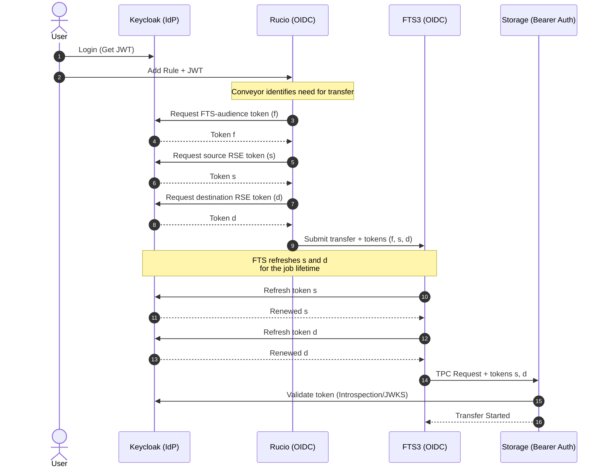

# dep-dlm-testbed

Self-contained DLM testbed with Rucio, FTS3, XRootD, Teapot WebDAV and OIDC provider (e.g. Keycloak). Runs end-to-end OIDC token orchestration tests on both `linux/amd64` and `linux/arm64`, across two runtimes: Docker Compose and Kubernetes. Extensible toward data discovery, popularity and preparation services and a full Rucio + FTS3 setup for external system integration.

## Backlog

Tracked future improvements and planned work items are maintained in [BACKLOG.md](./BACKLOG.md).

## Quick start

The recommended setup is to use the provided [dev container](./.devcontainer/devcontainer.json). This requires:
- [Docker](https://docs.docker.com/engine/install/) installed on your system
- An IDE with dev container support (e.g. [VS Code with the devcontainer plugin](https://marketplace.visualstudio.com/items?itemName=ms-vscode-remote.remote-containers))

### Docker Compose

```bash
# 1. Generate certificates
make certs

# 2. Start the stack
make compose-up

# 3. Initialize DEP DLM testbed
RUNTIME=compose make init

# 4. Run transfer tests
RUNTIME=compose make test-rucio-transfers
```

### Kubernetes

```bash
# 1. Generate certificates
make certs

# 2. Install the Helm chart
make helm-install

# 3. Initialize DEP DLM testbed
RUNTIME=k8s make init

# 4. Run transfer tests
RUNTIME=k8s make test-rucio-transfers
```

## Make Targets

```bash
  help                       Show this help (default target)

Setup
  certs                      Generate certificates (e.g. CA, hosts)
  init                       Initialize DEP DLM testbed (uses $RUNTIME — set RUNTIME=k8s for kubernetes)

Docker Compose lifecycle (compose-*)
  compose-up                 Start the full stack in the background
  compose-down               Stop the stack and remove volumes
  compose-restart            Tear down and restart the stack
  compose-rebuild            Rebuild and restart one or more services: make compose-rebuild SERVICES="teapot fts"
  compose-ps                 List running containers
  compose-logs               Tail logs from all services (Ctrl-C to exit)
  compose-logs-%             Tail logs from a single service, e.g. `make compose-logs-rucio`
  compose-build              Build local Docker images (e.g. fts, teapot)

Helm / Kubernetes lifecycle (helm-*, k8s-*)
  helm-lint                  Lint the umbrella chart
  helm-template              Render manifests locally (helm template …) without installing
  helm-install               Create the namespace and install the umbrella chart
  helm-upgrade               Apply local chart changes to the running release
  helm-uninstall             Uninstall the release and delete its PVCs
  helm-reinstall             Uninstall + install (full reset)

Tests
  test-rucio-transfers       Rucio E2E TPC transfer test

Cleanup
  clean                      Remove generated certs and volumes; keep CA (rucio_ca.pem + key)
```

## High Level Flow

The testbed exclusively supports the OIDC Token Flow, which is used for StoRM WebDAV and XRootD SciTokens integration.



> Token orchestration follows the design described in [Rucio Token Workflow Evolution](https://rucio.cern.ch/documentation/files/Rucio_Tokens_v0.1.pdf). Rucio acquires separate tokens for FTS authentication and for source/destination storage access, then bundles all three into the FTS submission. FTS is responsible for refreshing the storage-scoped tokens during the transfer lifetime.
