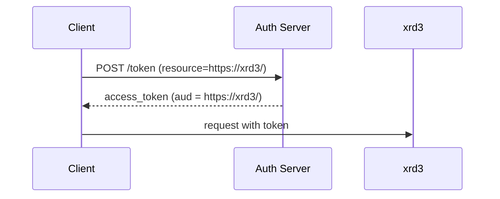
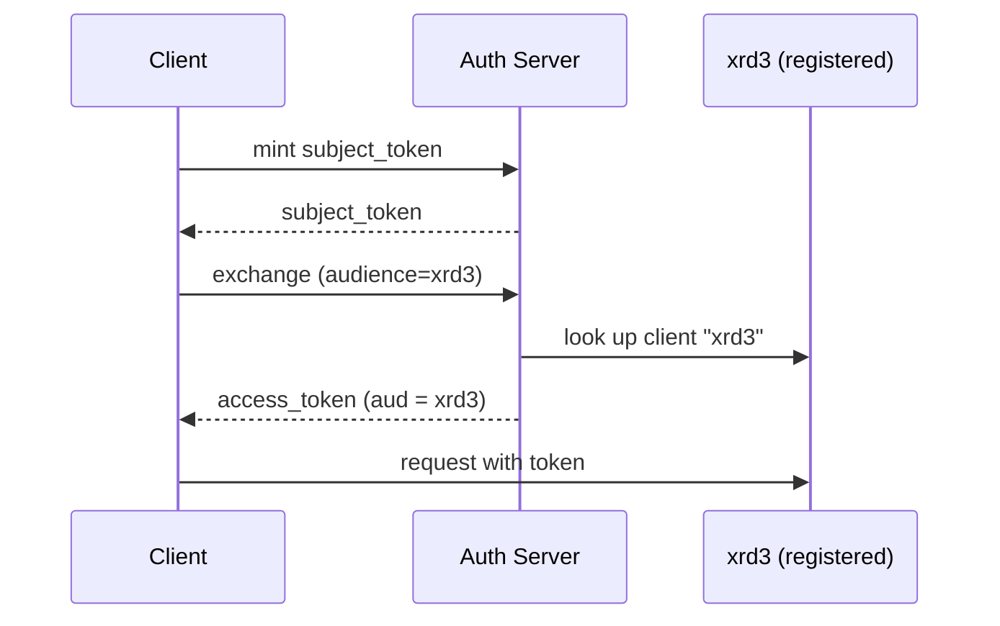
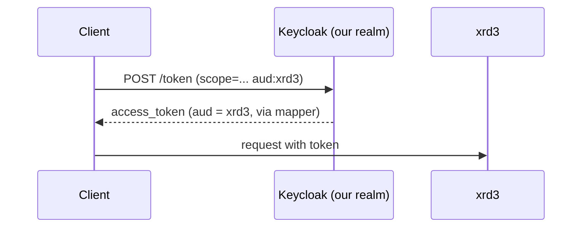

# Audience-restricted tokens: RFC 8707 vs RFC 8693 vs our scope-mapper hybrid

Problem: a client needs a token whose `aud` claim is scoped to one storage
endpoint (e.g. `xrd3`), not broadly valid. Three ways to get there.

## [RFC 8707 — Resource Indicators](https://datatracker.ietf.org/doc/html/rfc8707)

One request, `resource=` param sets `aud` directly.

```
POST /token
grant_type=client_credentials&resource=https://xrd3.example.org/&scope=read:/ write:/
```
```json
{ "aud": "https://xrd3.example.org/", "scope": "read:/ write:/" }
```


**Needs:** AS support for `resource`.
No client registration — any URI works.
**Pros:** single request, scales to any RSE with zero realm changes, dynamic.
**Cons:** requires a modern AS; no registration means weaker AS-side validation
of "is this a real target."

## [RFC 8693 — Token Exchange](https://datatracker.ietf.org/doc/html/rfc8693)

Mint a subject token, then exchange it for one scoped to a target audience —
audience must be a registered client.

```
POST /token
grant_type=urn:ietf:params:oauth:grant-type:token-exchange
&subject_token=...&audience=xrd3
```
```json
{ "aud": "xrd3", "azp": "699e9e29-..." }
```


**Needs:** a registered client per audience + exchange permission granted
per requester→target pair. Two requests per token.
**Pros:** works today (validated on EGI dev), tighter AS-side target
validation, mature/widely implemented.
**Cons:** doesn't scale (client + permission per new RSE), extra round-trip.

## Our realm.json — scope-based hybrid

Gets RFC 8707's one-request simplicity without needing `resource=` support:
a `clientScope` per target with an `oidc-audience-mapper` that writes a real
`aud` claim when requested.

```json
// clientScopes: one per audience
{
  "name": "aud:xrd3",
  "protocolMappers": [{
    "protocolMapper": "oidc-audience-mapper",
    "config": { "included.custom.audience": "xrd3", "access.token.claim": "true" }
  }]
}
```
```json
// rucio/fts clients: allowed to request it
{ "clientId": "rucio", "optionalClientScopes": ["aud:xrd3", "aud:xrd4", "..."] }
```



Same shape as RFC 8707 — one request, real `aud` — triggered by a scope
instead of `resource=`. Not a named standard, just a Keycloak workaround for
ASes without RFC 8707 support.

**Separately**, `realm.json` also registers `xrd3`/`xrd4`/`teapot1`/`teapot2`
as real clients (`token.exchange.standard.flow.enabled: true`) plus an FGAP
permission grant — this is the RFC 8693 machinery, used only by
`TOKEN_MODE=managed`'s refresh-token exchange, not by the scope path above.
The two flows are independent and coexist in the same realm.

**This audience-scoping step is identical for `managed` and `unmanaged`
mode** — the mode only changes who refreshes the token afterward
(`AllowNonManagedTokens` in FTS config, not `realm.json`).

## They combine, not just compete

RFC 8693 is a *grant type* (exchange one token for another); RFC 8707 is a
*request parameter* (pick the audience) usable on any grant type — including
inside a token-exchange call:

```
grant_type=...token-exchange&subject_token=...&resource=https://xrd3.example.org/
```

The requesting client stays the same (`rucio`/`fts`); only `audience=xrd3` is
replaced by `resource=https://xrd3.example.org/`,
which means the `xrd3`/`xrd4`/`teapot1`/`teapot2` client registrations
become unnecessary.
This would let managed mode keep its refresh-token exchange while dropping
the four per-endpoint client registrations, once EGI dev's Keycloak supports
`resource=` on the exchange grant specifically (worth confirming, not just
assuming from `client_credentials` support).

## Preferred / most common

- **RFC 8707**: modern, spec-aligned, where WLCG is heading — best once
  broadly supported.
- **RFC 8693**: mature, works today, right tool for real subject/actor
  delegation (not just audience-scoping).
- **Our scope mapper**: pragmatic stopgap for pre-8707 authorization servers.
- **RFC 8693 + RFC 8707 combined (`token-exchange` with `resource=` instead of `audience=`)**:
  likely the best long-term fit for managed mode specifically — keeps the refresh-token
  exchange we need, drops the four per-endpoint client registrations.
  Pending confirmation that EGI dev's Keycloak accepts `resource=` on the exchange grant.

## Managed vs. unmanaged — correction

Not "managed = short-lived + RFC 8707, unmanaged = long-lived." Audience
(8707/8693) and lifecycle (refresh) are separate axes:

- **managed**: RFC 8693 exchange mints a **refresh token**; FTS keeps minting
  fresh short-lived access tokens itself for the transfer's duration.
- **unmanaged**: no exchange, no refresh — Rucio's one token must outlive
  the whole transfer.
- **RFC 8707** has no lifecycle role either way — it only ever substitutes
  for 8693's `audience=` param.
