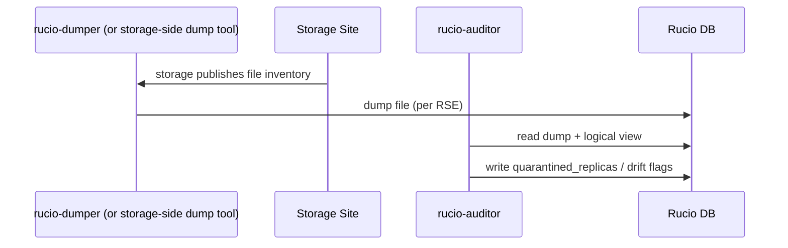
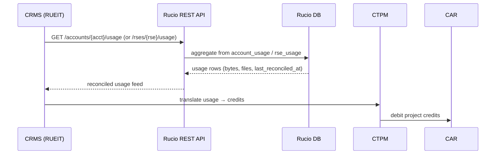
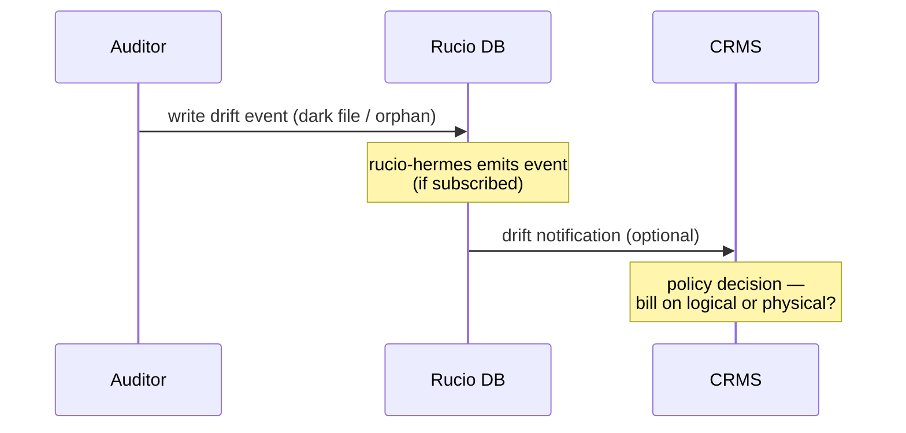

# CMS storage accounting

## Context

The Credit Management System (CRMS) needs storage-usage accounting to
translate consumption into credits via CTPM, allocate via CDPM, and bill
via CAR. The open question is **where the source of truth lives**:

- **Option A — Rucio-central:** CRMS queries Rucio; Rucio reconciles its
  logical view against physical storage via the Auditor daemon.
- **Option B — Per-storage:** CRMS queries each e-infra storage endpoint
  directly.

## Why Rucio-central is the working hypothesis

1. **Single accounting truth.** Rucio already maintains per-account,
   per-RSE usage in `rse_usage` and `account_usage` tables, updated by the
   Abacus daemons. CRMS gets one consistent answer regardless of how many
   storage backends exist. The Abacus daemons (`rucio-abacus-account`,
   `rucio-abacus-rse`) maintain these usage tables; the Auditor handles
   drift detection as a separate workflow.
2. **Identity model match.** CRMS reasons in terms of users and projects
   (CAR). Rucio knows users → accounts → DIDs → replicas → RSEs. Storage
   endpoints know paths and bytes — they don't know who owns what at the
   credit-accounting granularity CRMS needs.
3. **Existing reconciliation.** The Auditor daemon (`rucio-auditor`) reads
   dumps produced by the dumper and reconciles against the Rucio catalog.
   CRMS gets reconciled numbers for free.
4. **Stable API surface.** Rucio's REST API is versioned. Storage
   endpoints expose heterogeneous interfaces (XRootD, WebDAV, S3, POSIX)
   — direct CRMS-to-storage integration would multiply by N.

## Why per-storage is a real alternative worth considering

1. **Authoritative bytes.** Storage knows what's actually on disk; Rucio
   knows what *should* be. Drift exists.
2. **Avoids Rucio as critical path.** CRMS doesn't depend on Rucio
   availability for billing.
3. **Already-collected data.** Many sites publish usage to APEL/EGI
   accounting. CRMS could subscribe to existing feeds.

## Proposed model: Rucio-central with reconciliation

CRMS queries Rucio's API (`RUEIT` component) for usage. The Auditor
daemon periodically reads dumps produced by the `rucio-dumper` daemon and
writes reconciliation deltas back to Rucio. CRMS sees a single,
reconciled accounting feed. The runtime sequences below show this flow
concretely.

## What changes, what doesn't

| Component | Change |
| --- | --- |
| Rucio core | None — `rse_usage`/`account_usage` already exist |
| Rucio Auditor | Possibly extended reconciliation cadence; no new daemon |
| Rucio REST API | New endpoint(s) for CRMS-shaped accounting queries (or reuse existing) |
| CRMS RUEIT | New client to Rucio API |
| Storage endpoints | None — Auditor uses existing dump mechanisms |

## Open questions

- **Granularity.** Per-account, per-project, per-RSE, per-DID-scope?
  CRMS-side requirements drive this.
- **Cadence.** Real-time push, periodic pull, or event-driven? Affects
  whether `rucio-hermes` is in the loop.
- **Drift handling.** When Auditor finds physical ≠ logical, who is
  authoritative for billing — Rucio's view or the storage's?
- **Tape vs. disk.** Tape accounting often lags significantly; CRMS
  needs to know the freshness of each datapoint.
- **Multi-VO isolation.** CRMS scopes by project; Rucio scopes by
  VO/account. Mapping must be explicit.

---

## Runtime view

### Dumper-fed loop (Rucio-internal, periodic)

### CMS query (on-demand)

### Drift handling (when Auditor finds mismatch)

## References

- ADR: [`adr-009-cms-storage-accounting-via-rucio.md`](../adrs/adr-005-cms-storage-accounting-via-rucio.md.md)
