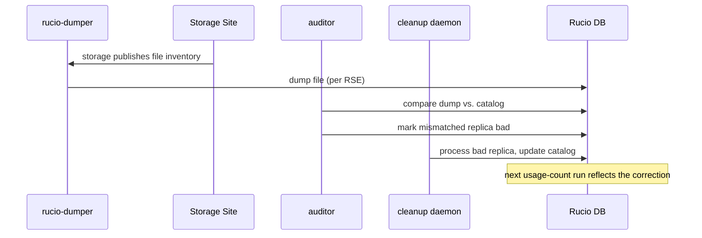
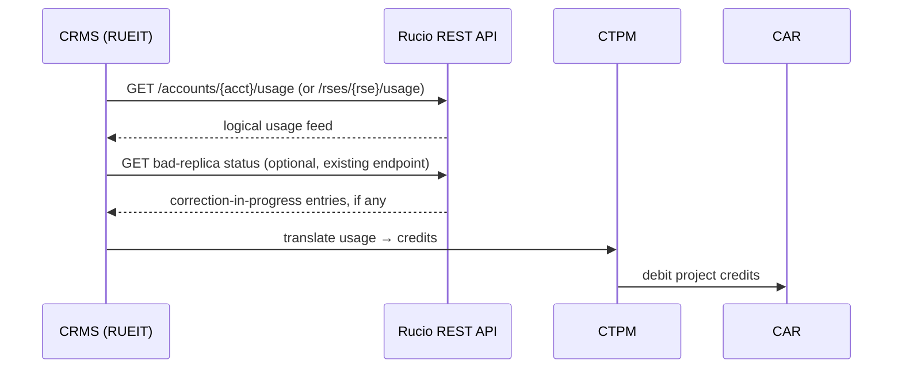

# CMS storage accounting

## Context

CRMS needs storage-usage accounting to translate consumption into
credits via CTPM, allocate via CDPM, and bill via CAR. Where does the
source of truth live?

- **Option A — Rucio-central:** CRMS queries Rucio's logical usage
  view. Divergence from physical storage is handled by existing
  daemons; the mechanism relevant to billing accuracy is already
  externally readable.
- **Option B — Per-storage:** CRMS queries each storage endpoint
  directly.

## Why Rucio-central is the working hypothesis

1. **Consistent logical view.** `rse_usage`/`account_usage`, updated
   by the Abacus daemons, give CRMS one consistent logical answer
   regardless of storage backend count. Not physically verified.
2. **Identity model match.** Rucio's account/scope/DID model maps to
   CRMS's project model; storage endpoints don't know ownership.
3. **Usage numbers self-correct, and that path is already readable.**
   When the catalog is wrong (a file it thinks exists doesn't), that's
   caught by the auditor, marked bad, and cleaned up by a downstream
   daemon — which eventually updates the catalog and, on the next
   usage-count run, corrects the number. This chain's current state
   (bad-replica status) is **already queryable today** via an existing
   endpoint — no new work needed.
   Separately, `quarantined_replicas` (DARK files — storage has data
   the catalog never knew about) was investigated as a possible drift
   signal, but these files were never counted in the usage number, so
   they're irrelevant to billing accuracy. No endpoint needed for
   this; not pursued further.
4. **Stable API surface.** One versioned REST API vs. N storage
   protocols.

## Why per-storage is a real alternative worth considering

1. **Storage-reported bytes** reflect what's actually there; Rucio's
   catalog can be temporarily wrong.
2. **Avoids Rucio as critical path** for billing availability.
3. **APEL/EGI feeds** exist but are storage-centric and possibly too
   coarse-grained for CRMS (unverified).

## Proposed model: Rucio-central, existing endpoints only

CRMS queries Rucio's usage endpoints for the logical view, and
optionally the existing bad-replica status endpoint if it wants
visibility into corrections in progress. No new Rucio endpoint is
needed. Usage numbers self-correct over time for catalog
overcounting, at an unmeasured lag — this should be measured before
deciding whether per-storage lookups are ever necessary.

## What changes, what doesn't

| Component | Change |
| --- | --- |
| Rucio core | None |
| Rucio daemons | None |
| Rucio REST API | None — existing usage and bad-replica-status endpoints are sufficient |
| CRMS RUEIT | New client to Rucio API, using existing endpoints only |
| Storage endpoints | None |

## Open questions

- **Correction lag.** How long does bad-replica → catalog update →
  usage-count correction actually take in practice? Not yet measured.
- **Granularity.** Per-account, per-project, per-RSE?
- **Cadence.** Periodic pull is the default; real-time push via
  `rucio-hermes` not implemented today.
- **Multi-VO isolation.** CRMS project ↔ Rucio account/scope mapping
  must be explicit.
- **Dispute escalation.** Worth a per-storage lookup path for
  disputed bills specifically, once correction lag is known?

---

## Runtime view

### Usage self-correction (Rucio-internal, periodic)

### CMS query (on-demand)

## References

- ADR: [`adr-005-cms-storage-accounting-via-rucio.md`](../adrs/adr-005-cms-storage-accounting-via-rucio.md)
