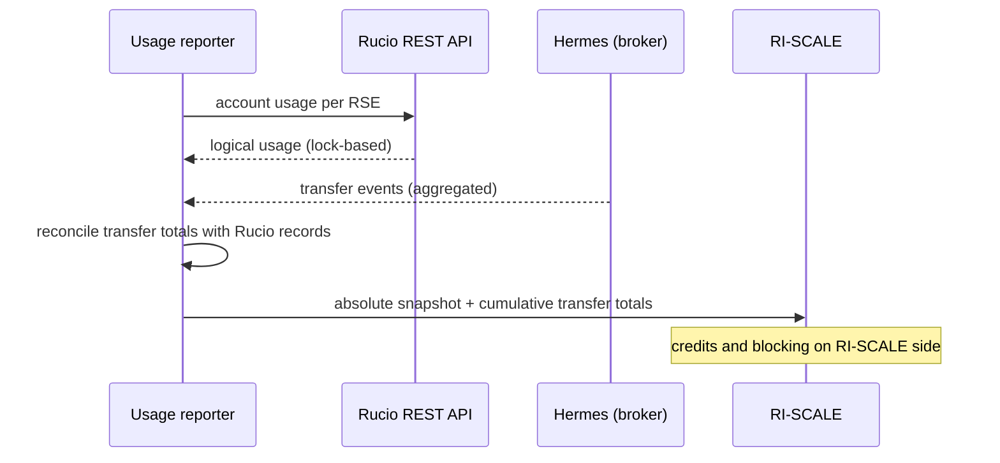
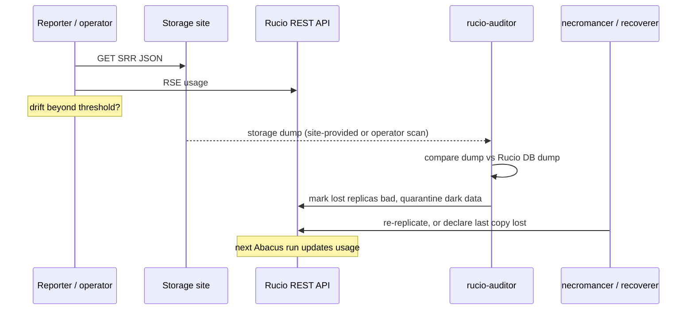

# Usage reporting for credits

Concept behind [ADR-005](../adrs/adr-005-usage-reporting-for-credits.md).
Forward-looking: credit management is out of scope for the second DEP release.

RI-SCALE owns the credits and blocks once they are exhausted. DEP **reports
usage** (storage volume and transfers) using existing Rucio machinery. Rucio
is a data source, not a lookup.

## Four sources, four questions

| Source | Answers | Granularity | Ownership |
| --- | --- | --- | --- |
| **Rucio** (`account_usage`, `rse_usage`, via Abacus) | *who* owns how much | per account × RSE | yes |
| **Rucio events** (Hermes → message broker) | *what* was transferred | per event | yes |
| **SRR** (WLCG Storage Resource Reporting) | *how much* is used physically | per storage share | no¹ |
| **Storage dump** | *what exactly* is there | per file | no |

¹ Only where a share maps 1:1 to a project (e.g. HPC project quotas).

Reports carry **logical managed volume** from Rucio, because credits need
ownership. SRR's physical volume is a provider capacity/cost measure and
serves as a drift check; dumps are the tool to find and fix the files behind
a drift. Events are a low-latency input only: they can be lost or duplicated,
so they are never the source of truth.

## What each source looks like

**Rucio usage**: computed by the Abacus daemons from replica locks (rules).
Replicas without a rule count against no account.

**Rucio events**: published by the Hermes daemon (e.g. transfer, deletion).
Delivery is not guaranteed, so aggregated transfer totals are reconciled
against Rucio's own records.

**SRR**: small JSON served by the storage over HTTP, refreshed roughly every
30 minutes:

```json
{
  "storageservice": {
    "name": "dep-teapot1",
    "implementation": "StoRM",
    "latestupdate": 1791200000,
    "storageshares": [
      {
        "name": "dep-rucio",
        "path": ["/data"],
        "vos": ["dep"],
        "timestamp": 1791200000,
        "totalsize": 10000000000000,
        "usedsize": 4200000000000
      }
    ]
  }
}
```

Native on StoRM, XRootD, dCache and EOS; S3 and HPC storage need a small
script (bucket metrics, filesystem quota) to publish it.

**Storage dump**: periodic file list per RSE, relative to the RSE prefix,
usually gzipped. The auditor needs only paths; sizes are worth asking for so
dumps can also back byte totals in disputes:

```
# path                              size  mtime
ddmlab/31/49/xrd-oidc-1791205168      11  2026-10-05T12:59:28Z
ddmlab/15/6e/xrd-oidc-1791204104      11  2026-10-05T12:41:58Z
randomaccount/a0/f0/dataset-file1  52428800  2026-10-01T08:12:03Z
```

Rucio does not scan storage itself: sites provide dumps, or an operator-run
scanner (WebDAV/XRootD/S3 listing) produces them.

## How reports stay correct

- **Storage:** timestamped **absolute** snapshots, so a missed report is
  corrected by the next one.
- **Transfers:** cumulative totals per period, reconciled periodically; lost
  or duplicated events are corrected, not accumulated.
- **Lost replica** (catalog has it, storage doesn't): the auditor finds it in
  a dump and marks it bad. If another copy exists it is re-replicated, so
  usage is unchanged; a lost last copy is removed and usage drops on the next
  Abacus run. Readable via `list_bad_replicas_status`.
- **Dark data** (storage has it, catalog doesn't): never in logical usage, so
  irrelevant to credits; a provider capacity/cost issue. Quarantined,
  optionally removed by `rucio-dark-reaper`.
- **Drift check**: per RSE, Rucio usage vs SRR `usedsize`. Beyond a threshold,
  run dump-based reconciliation to find the cause.

## What changes, what doesn't

| Component | Change |
| --- | --- |
| Rucio core, daemons, REST API | None |
| Usage reporter (new, small) | Reads Rucio usage, aggregates Hermes events, pushes reports to RI-SCALE; SRR fetch for the drift check |
| RI-SCALE | Owns credits and blocking; receives reports |
| Storage sites | Publish SRR (script for S3/HPC); provide dumps if reconciliation is wanted |

## Runtime view

### Usage report (periodic)



### Drift check and reconciliation (periodic)



## Open questions

See ADR-005. In short: granularity and cadence required by RI-SCALE, push vs.
pull delivery, transfer reconciliation method, SRR/dump availability per DEP
site, the drift threshold, and measured enforcement lag.
