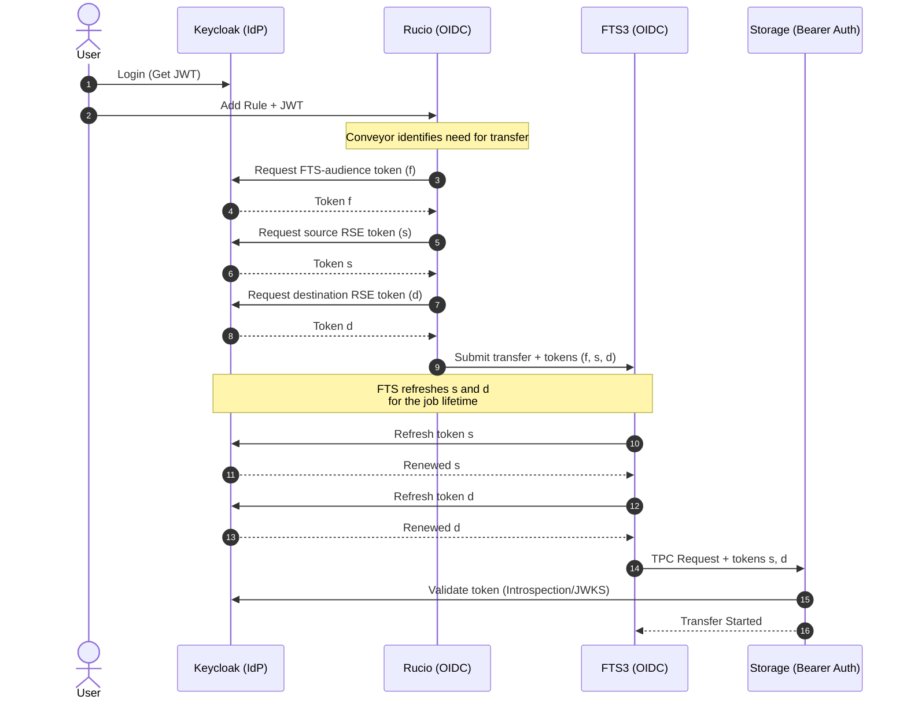
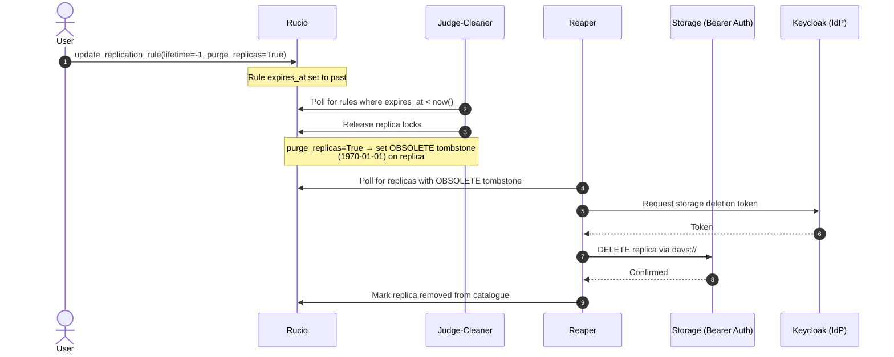

# High-Level flows

## OIDC Token Flow

The testbed exclusively supports token-based authentication. The sequence
below shows how Rucio, FTS3 and the storage endpoints coordinate token
acquisition and refresh for a single third-party copy (TPC) transfer.

> Token orchestration follows the design described in
> [Rucio Token Workflow Evolution](https://rucio.cern.ch/documentation/files/Rucio_Tokens_v0.1.pdf).
> Rucio acquires separate tokens for FTS authentication and for source/destination
> storage access, then bundles all three into the FTS submission. FTS is responsible
> for refreshing the storage-scoped tokens during the transfer lifetime.

## OIDC Deletion Flow

For reference checkout [the official Deletion Overview Rucio document](https://rucio.github.io/documentation/started/concepts/deletion_overview/).
