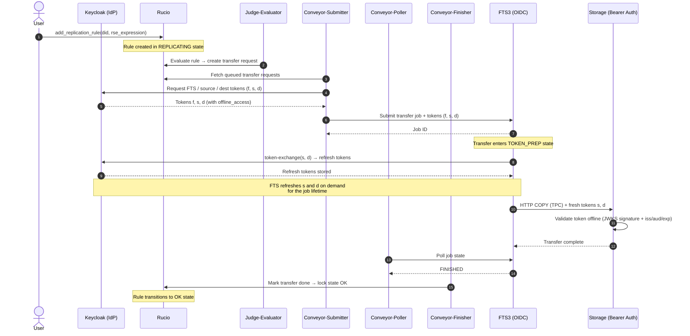
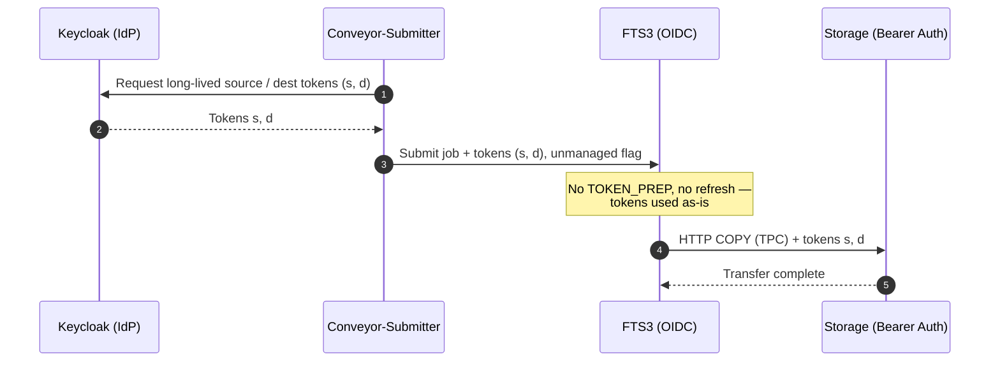
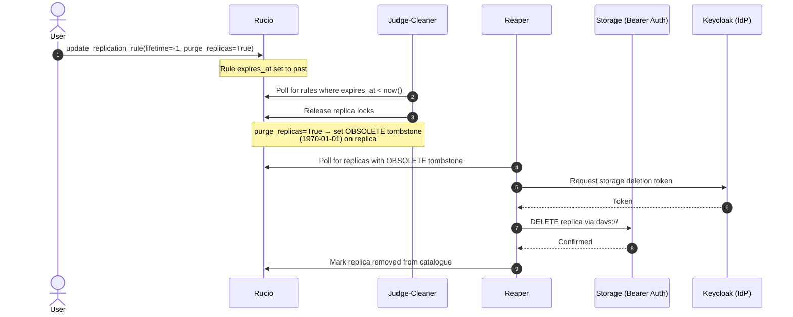

# High-Level flows

## OIDC TPC Transfer Flow

The testbed exclusively supports token-based authentication. The sequence
below shows how Rucio, FTS3 and the storage endpoints coordinate tokens for a
single third-party copy (TPC) transfer, including the Rucio conveyor daemons
that drive the pipeline.

Exercised by [test_rucio_transfers.py](../shared/tests/test_rucio_transfers.py):
`add_replication_rule` → judge-evaluator → conveyor-submitter → conveyor-poller
→ conveyor-finisher → rule state OK.

FTS can run in two token modes. The testbed currently supports both **managed and unmanaged token flows**.

### Managed mode

Rucio delegates short-lived access tokens; FTS owns the lifecycle, performing a
**token-exchange** (the `TOKEN_PREP` step) to obtain refresh tokens, then
refreshing on demand. The submitted storage tokens **must carry `offline_access`**
for the exchange to succeed.

### Unmanaged mode

Rucio delegates **long-lived per-file tokens** sized to cover scheduling +
transfer duration. FTS does **no** exchange and **no** refresh — no `TOKEN_PREP`.
Requires `unmanaged_tokens` on submission and `AllowNonManagedTokens` on FTS.

> Token orchestration follows the design in
> [Rucio Token Workflow Evolution](https://rucio.cern.ch/documentation/files/Rucio_Tokens_v0.1.pdf)
> and [FTS3 Token Support](https://doi.org/10.1051/epjconf/202533701329) (CHEP 2024).
> Rucio acquires separate tokens for FTS authentication and for source/destination
> storage access, then bundles them into the FTS submission. In managed mode FTS
> refreshes the storage-scoped tokens during the transfer; in unmanaged mode the
> token lifetime alone must cover the whole transfer.

## OIDC Deletion Flow

Rule-based deletion path, as exercised by
[test_rucio_deletion.py](../shared/tests/test_rucio_deletion.py):
`update_replication_rule(lifetime=-1)` expires the rule; Judge-Cleaner sets
the tombstone; Reaper physically deletes from storage.

**NOTE:** DID-based deletion (Undertaker) is a separate flow triggered by
DID expiration, not rule expiration. The Undertaker is not involved in the
flow below.

> For reference see the
> [official Rucio Deletion Overview](https://rucio.github.io/documentation/started/concepts/deletion_overview/).
