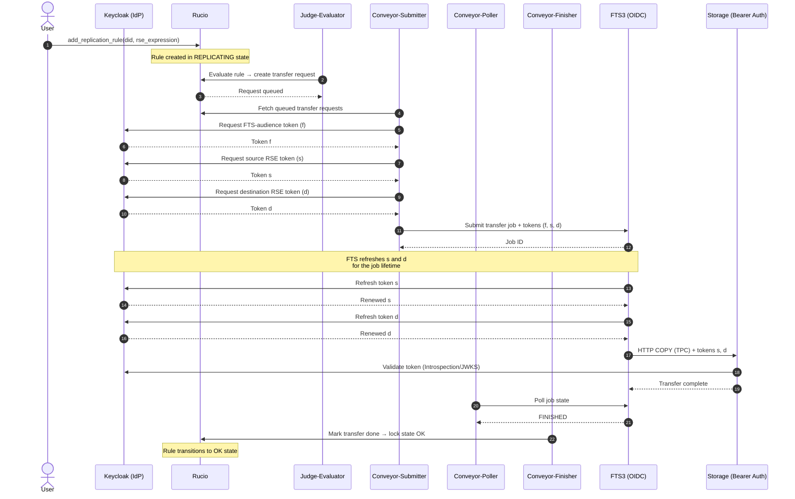
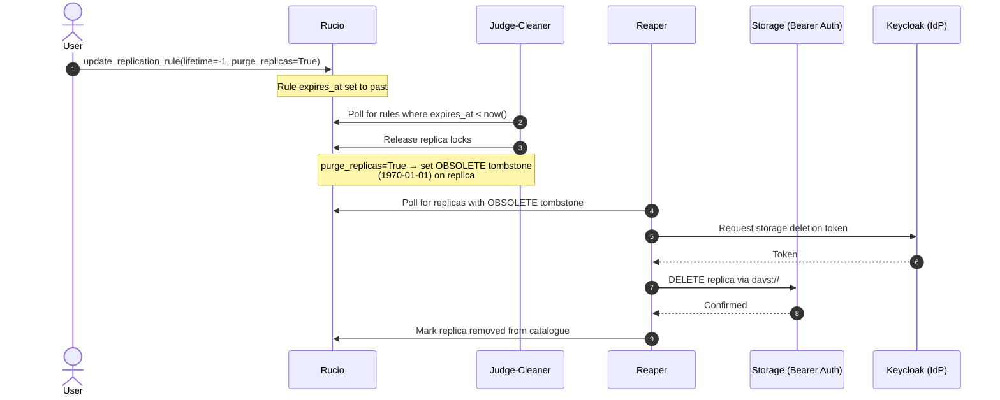

# High-Level flows

## OIDC TPC Transfer Flow

The testbed exclusively supports token-based authentication. The sequence
below shows how Rucio, FTS3 and the storage endpoints coordinate token
acquisition and refresh for a single third-party copy (TPC) transfer,
including the Rucio conveyor daemons that drive the pipeline.

Exercised by [test_rucio_transfers.py](../shared/tests/test_rucio_transfers.py):
`add_replication_rule` → judge-evaluator → conveyor-submitter → conveyor-poller
→ conveyor-finisher → rule state OK.

> Token orchestration follows the design described in
> [Rucio Token Workflow Evolution](https://rucio.cern.ch/documentation/files/Rucio_Tokens_v0.1.pdf).
> Rucio acquires separate tokens for FTS authentication and for source/destination
> storage access, then bundles all three into the FTS submission. FTS is responsible
> for refreshing the storage-scoped tokens during the transfer lifetime.

## OIDC Deletion Flow

Rule-based deletion path, as exercised by
[test_rucio_deletion.py](../shared/tests/test_rucio_deletion.py):
`update_replication_rule(lifetime=-1)` expires the rule; Judge-Cleaner sets
the tombstone; Reaper physically deletes from storage.

**NOTE:** DID-based deletion (Undertaker) is a separate flow triggered by
DID expiration, not rule expiration. The Undertaker is not involved in the
flow below.

> For reference see the
> [official Rucio Deletion Overview](https://rucio.github.io/documentation/started/concepts/deletion_overview/).
