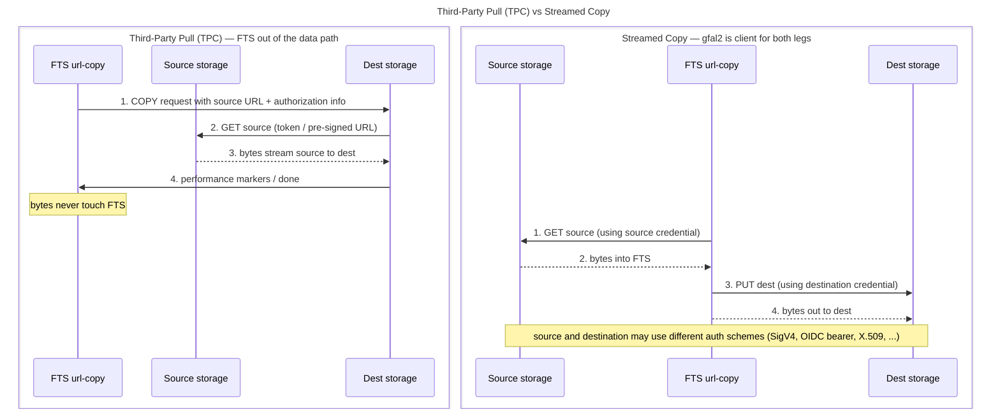

# Transfer Scenarios Overview

> This document discusses the commonly deployed HTTP-TPC **pull** mode, where
> the destination initiates the transfer by fetching from the source. HTTP-TPC
> also defines a push mode (source sends to destination); most WLCG deployments
> use pull, which is what the diagrams and matrix below describe.

## Third-Party Pull (TPC) vs Streamed Copy — sequence

## Transfer mechanism matrix

| Source | Destination | Mechanism | FTS in data path? | Notes |
|--------|-------------|-----------|-------------------|-------|
| WebDAV | WebDAV | TPC pull | No | TPC native; StoRM-WebDAV ([TPC docs](https://italiangrid.github.io/storm/documentation/sysadmin-guide/1.11.20/installation-guides/webdav/tpc/index.html)), dCache ([WebDAV TPC docs](https://github.com/dCache/dcache/blob/master/docs/UserGuide/src/main/markdown/webdav.md)), XrdHTTP ([xrootd-tpc](https://xrootd.web.cern.ch/doc/dev49/tpc_protocol.htm)) support PULL-based HTTP COPY |
| S3 | WebDAV | TPC pull *or* streamed | Conditional | TPC only if the WebDAV server can pull from S3 via pre-signed URL (dCache, StoRM-WebDAV do). If the S3 source issues no pre-signed URLs (e.g. CDSE/Copernicus) and the destination has no S3-aware plugin, TPC is not available — stream through FTS so gfal2 signs the GET (SigV4) and bearer-PUTs the destination ([FTS3 S3 support](http://fts3-docs.web.cern.ch/fts3-docs/docs/s3_support.html)) |
| XrdHTTP | WebDAV | TPC pull | No | HTTP TPC, same mechanism as WebDAV→WebDAV ([HTTP-TPC spec](https://twiki.cern.ch/twiki/bin/view/LCG/HttpTpc)) |
| WebDAV | S3 | Streamed | Yes | Native S3 has no HTTP-TPC/COPY mechanism, so an S3 endpoint cannot initiate a third-party pull; transfers into S3 stream through a client (FTS, rclone, aws-cli, ...) unless an intermediary gateway adds TPC ([FTS3 S3 support](http://fts3-docs.web.cern.ch/fts3-docs/docs/s3_support.html)) |
| XrdHTTP | S3 | Streamed | Yes | Same as above — S3 cannot be a TPC destination natively; FTS streaming or a TPC-capable S3 gateway ([FTS3 S3 support](http://fts3-docs.web.cern.ch/fts3-docs/docs/s3_support.html)) |
| S3 | S3 | Streamed | Yes | FTS streaming; gfal2 signs both legs. Native S3 tools (`aws s3 sync`) are outside FTS/grid scope ([FTS3 S3 support](http://fts3-docs.web.cern.ch/fts3-docs/docs/s3_support.html)) |
| S3 | XrdHTTP | TPC pull *or* streamed | Conditional | No intermediary if the XrdHTTP server has S3 plugin/redirect support; FTS streaming otherwise ([FTS3 S3 support](http://fts3-docs.web.cern.ch/fts3-docs/docs/s3_support.html)) |
| XrdHTTP | XrdHTTP | TPC pull | No | Native HTTP TPC ([xrootd-tpc](https://xrootd.web.cern.ch/doc/dev49/tpc_protocol.htm)) |
| XRootD (`root://`) | XRootD (`root://`) | Native XRootD TPC | No | If both endpoints support it ([XRootD TPC in WLCG](https://www.epj-conferences.org/articles/epjconf/pdf/2020/21/epjconf_chep2020_04031.pdf)) |
| XRootD (`root://`) | WebDAV / S3 / other | TPC where supported, otherwise streamed | Conditional | Crossing protocol families: native TPC depends on protocol-translation support at the endpoints; FTS streams otherwise ([FTS3 docs](https://fts3-docs.web.cern.ch/fts3-docs/)) |

**NOTE:**
- **Third-Party Copy (TPC) — pull:** the *destination* initiates and pulls from the source; bytes flow storage-to-storage and FTS stays out of the data path (it only issues the COPY and watches performance markers). Requires the destination to be able to authenticate to the source — the exact mechanism depends on protocol and implementation (bearer token, delegated credential, or a pre-authorized/pre-signed source URL). See the [HTTP-TPC protocol spec](https://twiki.cern.ch/twiki/bin/view/LCG/HttpTpc) and [WLCG HTTP-TPC technical details](https://twiki.cern.ch/twiki/bin/view/LCG/HttpTpcTechnical).
- **Streamed (intermediary) transfers:** gfal2 inside the FTS url-copy process is the client for **both** legs — it GETs from the source and PUTs to the destination, so each leg can use a *different* credential type (e.g. S3 SigV4 on the read, OIDC bearer on the write). Bytes pass through FTS, adding network load but removing any cross-credential requirement. This is the option of last resort when the two endpoints can't present each other's credential — notably **S3 source → WebDAV destination without pre-signed URLs (or an S3-aware destination plugin)**. See [FTS3 documentation](https://fts3-docs.web.cern.ch/fts3-docs/).
- **Why S3 often needs streaming:** S3 authenticates each request with **SigV4 request signing** by the client. Standard WebDAV and XRootD TPC implementations do not natively perform S3 SigV4 authentication against arbitrary S3 sources, so for a TPC pull the destination would need either a pre-signed source URL or a protocol-specific S3 plugin/adapter (which dCache, StoRM and some XRootD builds provide). When neither is available, the transfer must be streamed.
- **"Conditional"** entries depend on server-side configuration or plugin support — check your specific deployment before assuming TPC is available.
